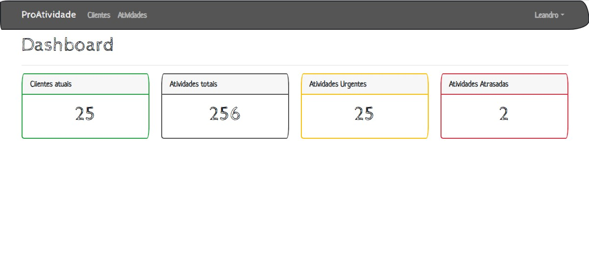
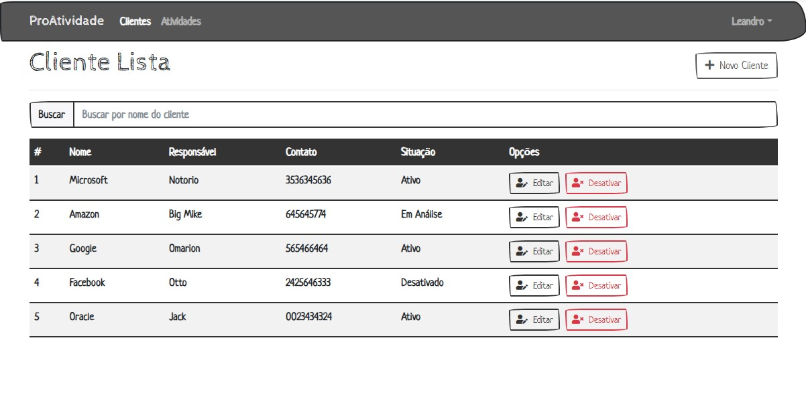
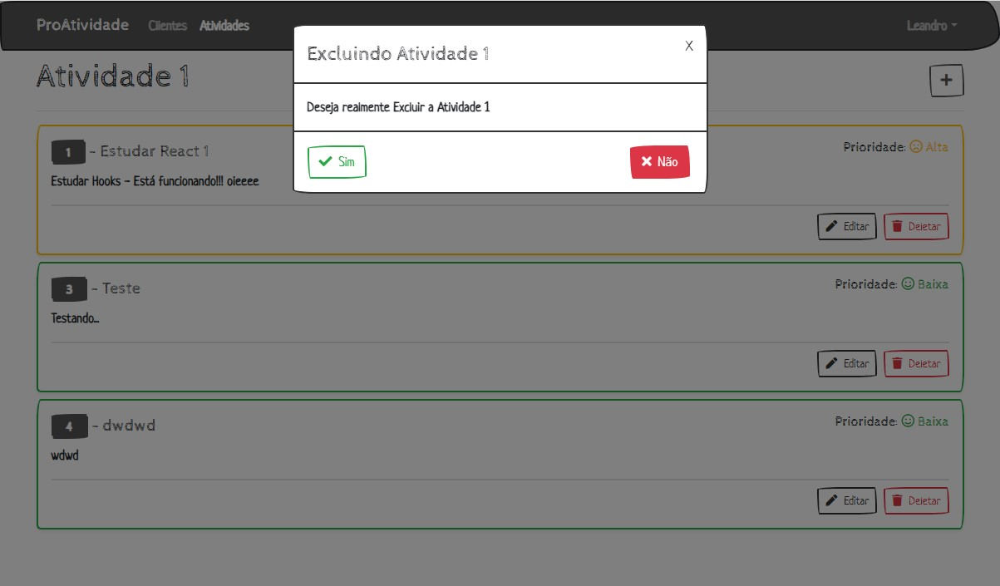
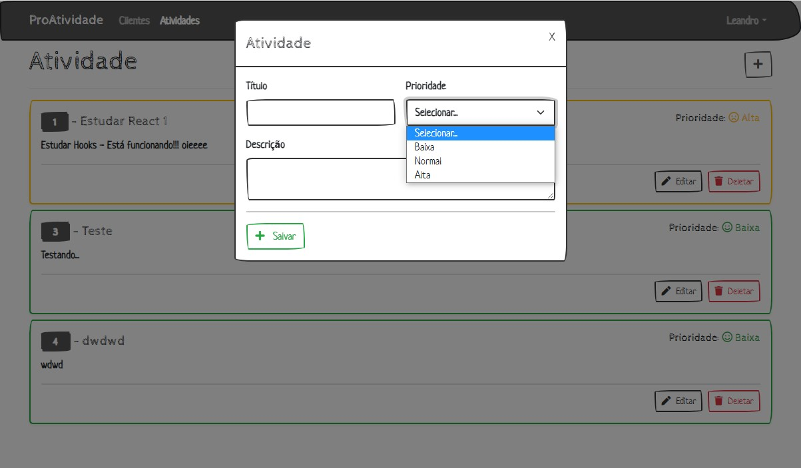
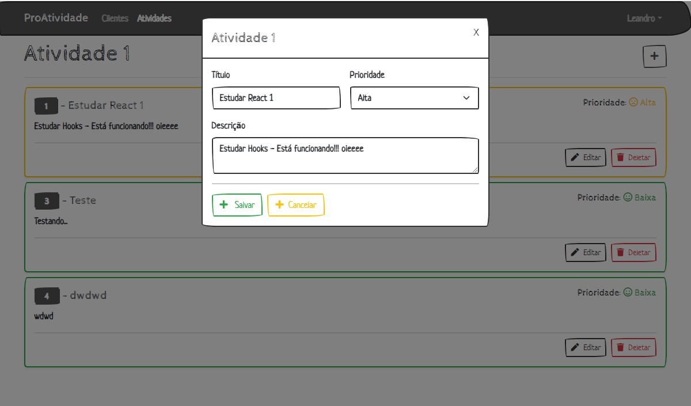

# react-proAtividade
Aplicação experimental de lista de atividades feita em React e .Net 6

## Descrição
Desenvolvendo uma pequena aplicação para salvar e listar atividades, testando assim algumas funcionalidade de .Net 6 e React como Hooks (useStates, useParams, useEffect, etc...), Estados, utilização do Axios para requisições Http para a API, eact Bootstrap para estilização e React-Router-Dom.

<hr>



<hr>



<hr>



<hr>



<hr>



<hr>


<hr>

## Pré requisitos para rodar o projeto

✔ - Visual Studio code ou Visual Studio 2022

✔ - .NET 6

✔ - Node.js

## Quick Start

```
  git clone https://github.com/leandro-SI/react-proAtividade
  
  cd front
  
  npm run start 
  
```


